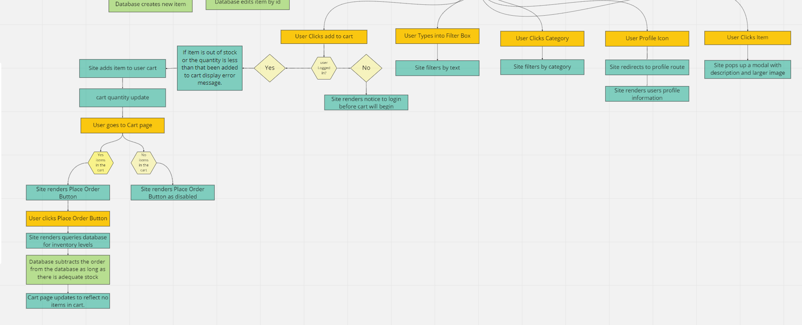

# Software Requirements Doc

## Vision

### Product Vison
To create a quality base for an online retail store using a secure login, administration channels for easy editing/inventory management, is user friendly, gives a appealing base UI to start with, and provides an easy shopping experience.

### Painpoint
To give a template store to new businesses that are looking to create an online presence. 

### Why Should We Care?
Our product will allow small businesses able to compete more in the global market. This is even more important currently in times of a pandemic, forcing retail further online.

## Scope

### IN Scope
* A starting point for businesses to create a retail store
* It will have a back end for administrators to manage inventory
* Will have a front end to allow users to shop easily
* Will have a cart section to allow users to manage their cart before checkout

### OUT of Scope
* Does not have secure payment/real checkout
* No actual products being sold

## Minimum Viable Product

A retail store template front that will allow a user to browse products, add them to a cart, view/edit their cart, and checkout which will clear the cart/update inventory levels.
A backend to the store that will allow a admin to edit users and inventory. Including add/delete funtionality.

## Functional Requirements

1. A retail store template front that will allow a user to browse products
2. Add products to a cart
3. To allow users to be able to view/edit their cart
4. Allow users to checkout which will clear the cart/update inventory levels.
5. A backend to the store that will allow a admin to edit users and inventory. Including add/delete funtionality.

## Non-Functional Requirements
1. Security
    * We are using auth0 for secure login and will be getting data about the user from auth0 instead of storing in sate. We want the end user of the store to have a custom experience tailored to their account.
2. Usability
    * A clear and functional UI that works how you would expect it to as a customer. To allow filtering via either text or category, allowing customers to easily find what they are wanting.

